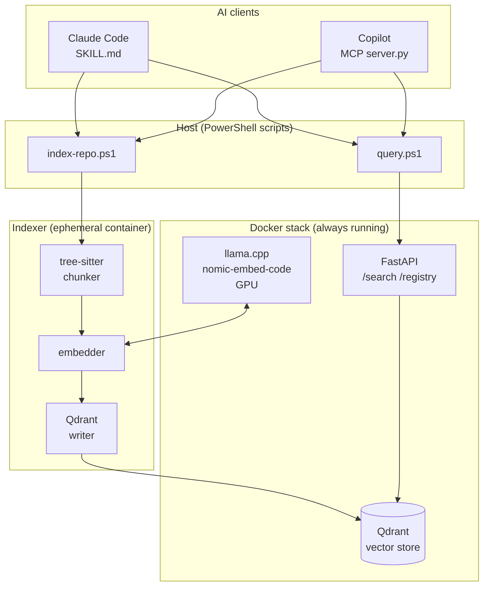

<div align="center">


# local_ai_code_vault

**GPU-accelerated semantic code search, running entirely on your machine.**  
Stop waiting for an LLM to read your files — query a vector index instead.

[](https://github.com/stickleprojects/local_ai_code_vault/actions/workflows/ci.yml)
[](https://www.python.org/)
[](https://docs.docker.com/compose/)
[](LICENSE)
[](SKILL.md)
[](vault_mcp/vault/README.md)

</div>

---

## Table of Contents

- [What it does](#what-it-does)
- [How it works](#how-it-works)
- [Requirements](#requirements)
- [Quick start](#quick-start)
  - [1 — Start the stack](#1--start-the-stack)
  - [2 — Install the Claude skill](#2--install-the-claude-skill)
  - [3 — Index a repo and search](#3--index-a-repo-and-search)
- [Copilot setup (MCP)](#copilot-setup-mcp)
- [Architecture](#architecture)
- [Development](#development)
- [Status](#status)

---

## What it does

Your AI assistant shouldn't have to read every source file to answer a question about your code. `local_ai_code_vault` keeps a **local vector index** of any repo you point it at, so Claude or Copilot can run a semantic search and get relevant chunks back in milliseconds — with **zero data leaving your machine**.

**Key features:**

- 🧠 **Semantic search** — `nomic-embed-code` embeddings (dim 3584, cosine) understand code intent, not just keywords
- 🔎 **Exact symbol mode** — grep-backed identifier completeness for “where is `Foo` defined/referenced?”
- ⚡ **GPU-accelerated** — `llama.cpp` server on CUDA; CPU fallback possible
- 🌳 **AST-aware chunking** — tree-sitter splits C#, Python, JS, and TS at function/class boundaries
- 🔄 **Auto-reindex on commit** — optional git hooks keep the index fresh after every `git commit`
- 🤖 **Dual AI client support** — same scripts drive both Claude Code (`/vault-*` skill) and GitHub Copilot (MCP adapter)
- 📦 **One clone, many repos** — install once, index any repo from anywhere

---

## How it works

```
Your repo
  │
  ▼  git commit hook (optional)
scripts/index-repo.ps1
  │
  ▼  docker run --rm  (ephemeral indexer container)
tree-sitter chunker ──► nomic-embed-code ──► Qdrant (local vector store)
                                                    │
                              ┌─────────────────────┘
                              ▼
                     FastAPI /search endpoint
                              │
              ┌───────────────┴───────────────┐
              ▼                               ▼
     Claude Code skill                 Copilot MCP adapter
     /vault-search "..."               vault_search(...)
```

All business logic lives in `scripts/*.ps1`. The Claude skill and Copilot MCP adapter are thin delegation layers — swapping or extending one client doesn't touch the other.

---

## Requirements

- Docker + Compose v2, an NVIDIA GPU + the NVIDIA Container Toolkit.
- PowerShell 7+ (`pwsh`) and `git` on PATH.

## Quick Applicability Map

- **Shared (Claude + Copilot):** stack startup, indexing, search data model,
  and host scripts in `scripts/`.
- **Claude only:** `/vault-*` skill flow and `install-skill.ps1`
  `-PermissionHook` approval-bypass options.
- **Copilot only:** MCP flow via `install-copilot.ps1` and MCP tools
  (`vault_index`, `vault_search`, etc.).

## Usage

**You clone this repo once.** Its `scripts/` and `SKILL.md` are **never
copied into the repos you want to search** — the skill calls the central
scripts by absolute path, and they take the target repo as an argument.

1. **Start the stack:** `cp .env.example .env` then
   `docker compose up -d --build`. Full setup, GPU prerequisites, and
   validation steps: [README_SETUP.md](README_SETUP.md).
2. **Install Claude skill (one-time, from this clone, Claude only):**
   `pwsh -NoProfile -File scripts/install-skill.ps1`, then restart
   Claude Code. This places the skill in `~/.claude/skills/vault/` (so
   `/vault-*` works in _any_ repo) and records `VAULT_HOME` so it can
   find the scripts. Re-run it if you move/update the clone;
   `-Remove` uninstalls.

   > ⚠️ **SECURITY WARNING — read this before using `-PermissionHook
Install`.** By default Claude Code asks you to approve **every**
   > `/vault-*` call. The optional `-PermissionHook Install` writes an
   > auto-allow hook into your **global** `~/.claude/settings.json` so
   > that PowerShell calls to vault scripts **run without asking you**.
   > Everything else still prompts, but this **deliberately disables a
   > safety check**. **If you turn this on, that is your choice and the
   > risk is on you** — anything able to produce a matching command can
   > then run vault scripts unprompted. The installer will **not** do
   > this unless you explicitly opt in (interactive: you must type
   > `yes`; or pass `-PermissionHook Install`); it is fail-closed, backs
   > up `settings.json` first, and never disables your antivirus. The
   > **safe default does nothing** — install the skill, try `/vault-*`
   > with the prompt on, and only enable the bypass later (re-run with
   > `-PermissionHook Install`) if you accept the trade-off.
   > Bitdefender/AMSI note: see
   > [Good antivirus citizen (Claude only)](docs/TROUBLESHOOTING.md#good-antivirus-citizen-claude-only)
   > for exact guidance.
   > `install-skill.ps1 -Remove` removes the hook again. Full trade-off,
   > the exact hook, and undo: [docs/TROUBLESHOOTING.md](docs/TROUBLESHOOTING.md).
   >
   > If you only use Copilot, skip this step and go to
   > [Copilot global setup](README.md#copilot-global-setup-mcp-no-per-repo-config-copilot-only).

3. **Open the repo you want to search** in Claude Code (any repo,
   anywhere — it does not need this project's files).
4. **Index it:** `/vault-index` (or, by hand from this clone,
   `pwsh -NoProfile -File scripts/index-repo.ps1 <repo-path> -Build -Wait`).
5. **Search:** `/vault-search "<query>"`, or check state with
   `/vault-status`, inspect what's indexed with `/vault-inspect`, view
   estimated savings with `/vault-savings`, and auto-reindex on commit
   with `/vault-hooks`.

The skill is pure delegation; all logic is in standalone, individually
runnable scripts — contracts in [scripts/README.md](scripts/README.md).

## Automatic agent use (typical)

Most users will not type `/vault-*` directly. A more typical flow is:

1. User asks for a code change in plain language.
2. Claude/Copilot uses vault search/index tools behind the scenes to
   gather relevant code context.
3. Agent applies edits and tests with less broad file-searching.

### Example 1: schema/property rename

User prompt:

`change customer.surname to customer.lastname everywhere and fix tests`

Typical agent behavior with vault:

1. Finds model definitions, DTOs, serializers, mappers, API handlers,
   and tests that reference surname semantics.
2. Updates code + tests in targeted files.
3. Returns a normal edit summary.

How savings would be displayed:

- If savings are meaningful, include one line in search-style output:
  `Upper-bound savings this query: 1320 tokens across 3 files (76%).`
- If savings are zero/non-meaningful, omit the line (no noise).

### Example 2: behavior change request

User prompt:

`add retry with exponential backoff to payment API calls and update tests`

Typical agent behavior with vault:

1. Locates existing retry/backoff utilities and payment call sites.
2. Reuses project patterns for error handling/timeouts.
3. Updates integration tests around retry behavior.

How savings would be displayed:

- If the query path returns measurable savings:
  `Upper-bound savings this query: 940 tokens across 2 files (63%).`
- If the agent did not run a vault query (or savings are zero), no
  savings line is shown.

Savings numbers are estimates and upper bounds; details are available
via `/vault-savings` (Claude) or `vault_savings` (Copilot).

## Search safety behavior (shared)

Claude and Copilot now share the same search safety logic through a
single script wrapper (`scripts/query-smart.ps1`):

1. If vault is reachable but the repo is not indexed, the agent prompts
   once with opt-out wording and indexes by default unless you say
   `do not index`.
2. If vault is unavailable, indexing is declined, or semantic search
   returns no hits, the agent falls back to normal workspace file
   search/read flow.
3. In every fallback case, the user is told why vault was not used.

This keeps vault preferred (for token/context efficiency) without
blocking normal coding flow when vault cannot help.

## Semantic vs exact symbol search

- Use **semantic search** for fuzzy discovery and intent-based lookup.
- Use **symbol mode** (`query-smart.ps1 ... -Symbol`, or `-Mode symbol`) for
  exact identifier completeness (“does this symbol exist anywhere?” / “where are all references?”).

## Shared Claude + Copilot architecture

Claude and Copilot intentionally reuse the same runtime contracts:

- **One script layer (`scripts/*.ps1`)** is the only place where vault
  business logic lives.
- **Claude skill (`SKILL.md`)** delegates `/vault-*` commands to those
  scripts.
- **Copilot MCP adapter (`vault_mcp/vault/server.py`)** delegates MCP tools to
  the same scripts.

This keeps behavior aligned across both clients and avoids duplicated
implementation paths.

## Copilot global setup (MCP, no per-repo config, Copilot only)

Copilot can use the same host scripts via a thin MCP adapter, installed
once at user scope (no repo-local Copilot files required):

1. `pwsh -NoProfile -File scripts/install-copilot.ps1`
2. Restart VS Code/Copilot.
3. In any repo, ask Copilot to run `vault_index` (or run
   `pwsh -NoProfile -File scripts/index-repo.ps1 <repo-path>` manually).
4. Use `vault_search`, `vault_status`, `vault_inspect`, `vault_savings`,
   `vault_hooks`.

Validation checklist:

- [ ] `install-copilot.ps1` reports `installed:true` and shows a
      `settings_path`.
- [ ] In a new repo, Copilot can call `vault_index`/`vault_status`
      without adding repo files.
- [ ] If a repo is unregistered (`code:5`), Copilot offers indexing.
- [ ] Existing Claude `/vault-*` flow still works unchanged.
| Requirement                        | Notes                                                                    |
| ---------------------------------- | ------------------------------------------------------------------------ |
| **Docker + Compose v2**            | `docker compose version`                                                 |
| **NVIDIA GPU + Container Toolkit** | CPU-only mode possible but slow — see [README_SETUP.md](README_SETUP.md) |
| **PowerShell 7+** (`pwsh`)         | Windows, macOS, or Linux                                                 |
| **git** on PATH                    | For repo-id computation and hooks                                        |

---

## Quick start

**You clone this repo once.** Its `scripts/` and `SKILL.md` are _never_ copied into the repos you search — the skill calls the central scripts by absolute path.

### 1 — Start the stack

```powershell
cp .env.example .env
docker compose up -d --build
```

Full GPU prerequisites and validation checklist: [README_SETUP.md](README_SETUP.md).

### 2 — Install the Claude skill

```powershell
pwsh -NoProfile -File scripts/install-skill.ps1
# then restart Claude Code
```

This places the skill in `~/.claude/skills/vault/` so `/vault-*` works in **any** repo, and records `VAULT_HOME` so scripts can always be found. Re-run if you move or update the clone; `-Remove` uninstalls.

<details>
<summary>⚠️ Optional: auto-allow permission hook (read before enabling)</summary>

By default, Claude Code asks you to approve **every** `/vault-*` call. The optional `-PermissionHook Install` flag writes an auto-allow rule into your **global** `~/.claude/settings.json` so vault script calls run without prompting.

> **This deliberately disables a safety check.** If you enable it, that is your choice and the risk is on you — anything that can produce a matching command pattern will run vault scripts unprompted. The installer is fail-closed (backs up `settings.json` first) and will not proceed unless you type `yes` interactively or pass the explicit flag.

The safe default does nothing — try `/vault-*` with prompting on first, and only enable the bypass later if you accept the trade-off.

```powershell
# opt in explicitly:
pwsh -NoProfile -File scripts/install-skill.ps1 -PermissionHook Install

# undo:
pwsh -NoProfile -File scripts/install-skill.ps1 -Remove
```

Full trade-off analysis and the exact hook JSON: [docs/TROUBLESHOOTING.md](docs/TROUBLESHOOTING.md).

</details>

### 3 — Index a repo and search

Open **any** repo in Claude Code, then:

```
/vault-index           ← chunks + embeds the current repo
/vault-search "how does authentication work?"
/vault-status          ← check indexing state
/vault-inspect         ← browse what's in the index
/vault-hooks           ← install git hooks for auto-reindex
```

Or drive it manually from this clone:

```powershell
pwsh -NoProfile -File scripts/index-repo.ps1 C:\path\to\your\repo -Build -Wait
```

Script I/O contracts and exit codes: [scripts/README.md](scripts/README.md).

---

## Copilot setup (MCP)

The same scripts are accessible from GitHub Copilot via a thin [MCP](https://modelcontextprotocol.io/) adapter — no per-repo config files required.

```powershell
pwsh -NoProfile -File scripts/install-copilot.ps1
# restart VS Code / Copilot
```

Then in any repo, ask Copilot to call `vault_index`, `vault_search`, `vault_status`, or `vault_inspect`.

**Validation checklist:**

- [ ] `install-copilot.ps1` reports `installed:true` with a `settings_path`
- [ ] Copilot can call `vault_index` / `vault_status` in a new repo without adding any repo-local files
- [ ] An unregistered repo (`code:5`) triggers Copilot to offer indexing
- [ ] Existing Claude `/vault-*` flow still works unchanged

---

## Architecture



Design decisions (AD-1 through AD-10) and the full phase plan: [plan.md](plan.md) · [docs/ARCHITECTURE.md](docs/ARCHITECTURE.md).

---

## Development

```bash
# Python tests (in-memory fakes — no stack needed)
pytest -v

# PowerShell tests (fakes git/docker/API — no stack needed)
pwsh -NoProfile -File tests/scripts.Tests.ps1

# Live end-to-end smoke test (requires running stack)
pwsh -NoProfile -File tests/smoke_test.ps1
```

Replay eval status: `eval-replay` is wired into CI, but it only runs once the maintainer-recorded `eval/vectors.json` fixture is committed. Until then the job skips cleanly and remains non-required. Full recorder/replay instructions: [eval/README.md](eval/README.md).

CI runs `pytest` on every PR to `main`. Branch protection is strict — never commit directly to `main`; use feature branch → PR → merge. Full conventions: [CLAUDE.md](CLAUDE.md).

---

## Status

| Phase     | Description                       | State       |
| --------- | --------------------------------- | ----------- |
| 1         | Docker stack, indexer, query API  | ✅ complete |
| 2         | Claude skill + PowerShell scripts | ✅ complete |
| 3         | Testing, validation & docs        | ✅ complete |
| 4.2       | CHANGELOG + release tagging       | ✅ complete |
| 4.1 / 4.3 | Image publishing to registry      | ⏸ deferred  |

See [plan.md](plan.md) for the full roadmap and architecture decision log.
